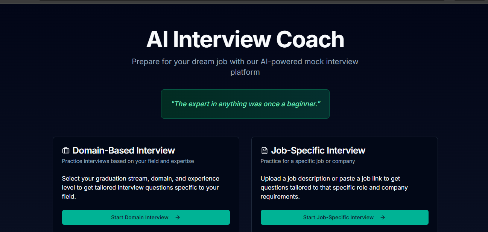
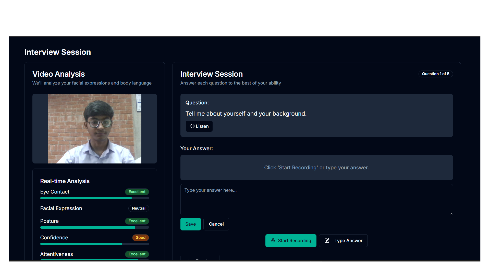

# 🧠 AI Interview Coach

Prepare for your dream job with our **AI-powered mock interview platform**!  
This tool helps you sharpen your interview skills through domain-based and job-specific sessions, complete with **real-time video analysis** and performance insights.

> **"The expert in anything was once a beginner."**

---

> ### ⚠️ **Project Status: Under Maintenance**
> This project is currently being updated and improved.

> This project is currently under maintenance to improve performance, refine features, and deliver a better user experience.  
> Please check back later or star the repository to stay updated!

---
## 📸 Demo Screenshots

<h3>🏁 Landing Page</h3>

<h3>🎥 AI-Powered Interview Session</h3>

---

## 🧩 Features

- 🎯 **Domain-Based Interviews**: Get tailored questions based on your graduation stream and experience.
- 🏢 **Job-Specific Interviews**: Upload job descriptions or links to generate role-specific questions.
- 📹 **Live Video Feedback**: Receive real-time feedback on:
  - Eye Contact 👀
  - Facial Expressions 😊😐
  - Confidence 💬
  - Posture 🧍
  - Attentiveness 🔍
- 🔊 **Voice + Text Support**: Answer questions via typing or voice recording.

---

